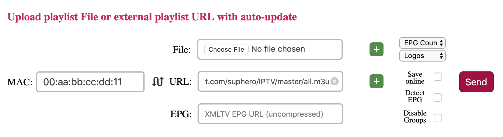

# IPTV

You don't need to pay for a TV provider if you can stream videos online (and you have network quota).

- Download [Smart IPTV app](https://siptv.eu/howto/) for your TV
- Activate your TV on [Smart IPTV Activation](https://siptv.eu/activation/) for 5.49 USD ( Yes, I paid too :[ )
- Upload the playlist with URL you prefer:
  - [TR: All](https://raw.githubusercontent.com/suphero/IPTV/master/TR/All.m3u)
  - [TR: 720p](https://raw.githubusercontent.com/suphero/IPTV/master/TR/720p.m3u)

- I am trying to update the playlist and your app will show updated version :)
